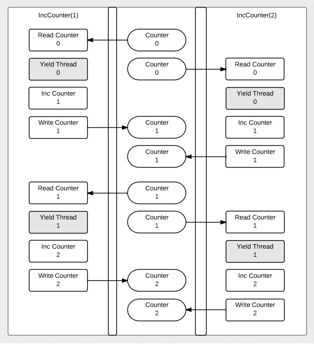

這是一個常見用來示範「資料競 race」或「並發讀寫流程」的示意圖。圖中有兩個執行緒（或 goroutine），分別執行名為 IncCounter(1) 與 IncCounter(2) 的函式，並且都在操作同一個共享變數（Counter）。我可以大致說明圖中的流程與涵義：

1. 兩條垂直泳道（Swimlane / Timeline）

圖中有兩條垂直線，各代表一個獨立的執行緒（或 goroutine）的執行流程：

左邊：IncCounter(1)

右邊：IncCounter(2)

這表示在同一段程式中，有兩個並行的流程同時（或交錯）執行，每一條垂直線從上往下顯示該執行緒的動作順序。

2. 每個執行緒的操作步驟

在每條垂直線上，都標示了對共享變數 Counter 的一系列操作，包括：

Read Counter：讀取當前 Counter 的值

Yield Thread（或有時候叫 Gosched() / Thread Yield）：主動讓出 CPU 執行權，讓其他執行緒（或 goroutine）有機會運行

Inc Counter：對 Counter 的值做遞增（在程式碼層面可能是 temp = Counter + 1）

Write Counter：把遞增後的值寫回 Counter
這四個步驟是一個典型的「讀、改、寫」流程，如果沒有任何同步機制（例如互斥鎖、原子操作），就可能在多執行緒環境下發生競爭條件（race condition）。

3. 為什麼要畫出 Yield / Gosched？

在示意圖裡，之所以特別把「Yield Thread」標出來，是為了強調：

執行緒在「讀取」完之後，可能會被排程器（Scheduler）切換走，導致另一個執行緒也去讀取舊的值。

最後可能兩個執行緒都只看到「舊值」而分別做加一，結果寫回去的值不是你所期待的「總共加二」，而是只加了一次，導致資料不一致。

這種「先讀取相同舊值」的情境，在圖中會表現為：左邊的 IncCounter(1) 讀取完之後 yield，右邊的 IncCounter(2) 也去讀取，得到一樣的值，接著各自加 1、各自寫回去，最終整個 Counter 只增加了 1，而不是 2。

4. 從圖中看到的流程

就圖中的箭頭來看，似乎示例了兩次遞增的流程：

第一輪：

IncCounter(1) 讀取到 Counter=0 -> yield ->

IncCounter(2) 也讀取到 Counter=0 -> yield ->

接著各自把 Counter 加到 1，並寫回，最後結果是 Counter=1（但從圖看起來，兩邊都把值寫成 1，看似只有加了 1 次）

第二輪：

又各自讀取到剛才寫回去的 1 -> yield ->

再次把 1 加到 2，寫回 Counter=2

所以最後得到 Counter=2。不過這張圖其實想表達的重點通常是：在沒有同步機制的情況下，兩條線的「讀、改、寫」動作可以交錯得非常複雜，可能會造成結果不符合預期。例如在某些執行時序下，兩條線都讀到 0，最後寫回 1，導致只有加了 1，而不是 2。

5. 核心概念：Data Race（資料競爭）

當多個執行緒（或 goroutine）同時讀寫共享變數，而且至少有一個寫操作，且這些操作沒有任何同步措施（鎖、原子操作、channel 等）時，就會產生「資料競爭」(data race)。結果是程式行為不可預期，可能出現「加一」失敗、或「寫入」被覆蓋等問題。

解決方式

互斥鎖 (Mutex)：在讀寫共享資源時加鎖，確保同一時間只有一個執行緒可以操作。
原子操作 (atomic)：使用 Go 的 sync/atomic 套件提供的原子函式，如 atomic.AddInt64。

Channel 同步：透過 channel 來傳遞資料，避免同時讀寫。

6. 總結

看懂這張圖：它展示了兩個並行流程如何對同一個 Counter 做「讀、改、寫」操作，並且在中間故意有個「Yield」的動作，讓另一條線也能插入讀取，模擬實際程式中隨機的執行緒切換。

核心議題：沒有同步機制的「讀、改、寫」在多執行緒環境下會造成 race condition。結果往往會比預期少加了次數，或寫入錯誤的值。

換句話說，這張圖主要是為了強調如果程式沒有使用同步機制，在並發環境下，像 Counter++ 這種操作（其實背後是三步：讀、加一、寫）很可能不安全，導致最終結果不正確。

---

Atomic 操作與互斥鎖（Mutex）都是用來保護共享資源在多執行緒或多 goroutine 環境下的數據安全，但它們的工作方式和適用場景有一些重要區別：

1. Atomic 操作

概念：

Atomic 操作是一組底層的原子性指令，用來對簡單的資料型別（例如整數、指標）進行不可分割的操作。這些操作由硬體或底層系統提供支持，因此在執行時不會被中斷。

特點：

無鎖（Lock-free）： 無需顯式地獲取或釋放鎖，操作過程中不會導致阻塞。

低開銷： 由於操作是原子性的，通常比鎖的開銷小。

適用範圍有限： 一般僅能用於簡單的數據更新（如計數器、標誌位等），無法保護複雜結構。

2. 互斥鎖（Mutex）

概念：

互斥鎖是一種同步原語，用來保護一段臨界區（critical section），確保在同一時間只有一個 goroutine 能進入該區域對共享資料進行操作。

特點：

阻塞（Blocking）： 當一個 goroutine 獲取鎖後，其他試圖獲取該鎖的 goroutine 會被阻塞，直到鎖釋放。

通用性： 可用來保護任何複雜的資料結構和操作，適用範圍更廣。

潛在開銷： 如果鎖競爭嚴重或使用不當，可能會引起性能下降或死鎖問題。

3. 差異總結

操作範圍：

Atomic 操作：主要適用於簡單的資料類型（如整數、指標）和簡單的操作。

Mutex：適用於需要保護複雜資料結構或多步驟操作的情境。

性能與開銷：

Atomic 操作：因為無鎖，性能開銷較低，但功能較受限。

Mutex：因為涉及鎖的獲取和釋放，開銷較高，且存在阻塞的可能，但能保護更廣泛的操作。

編程複雜度：

Atomic 操作：雖然低開銷，但編程邏輯需要格外謹慎，容易產生難以理解的鎖自由算法。

Mutex：編程上更直觀，通過鎖定臨界區來確保安全，易於理解和維護。

選擇哪種方式主要取決於你的需求：如果只是對數字計數器進行簡單操作，原子操作可能更高效；而如果操作較複雜，使用互斥鎖則能更好地確保數據一致性和安全性。